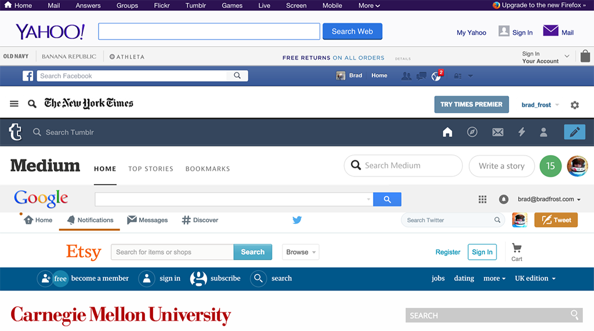

# Sample SwiftUI app sử dụng mô hình Atomic Design

## Atomic Design là gì?	

Atomic Design là Một phương pháp thiết kế giao diện mà Designer sẽ ưu tiên thực hiện thiết kế các thành phần riêng lẻ và kết hợp chúng lại với nhau, thay vì thiết kế cả trang.
	
Thuật ngữ này được giới thiệu bởi Brad Forst trong năm 2013. Atomic Design là cách tiếp cận kiểu thiết kế giao diện bằng cách xây dựng nên một hệ thống các components thay vì các trang. Phương pháp này chú trọng đến các đối tượng nhỏ, độc lập, tái sử dụng các thành phần để kết hợp chúng lại tạo thành 1 tổng thể. Điều này cho phép hoàn thành sản phẩm nhanh chóng, giao diện thống nhất và dễ dàng bảo trì.

•	Trong Atomic Design: giao diện được chia thành 5 phần:

* **Atoms**
* **Molecules**
* **Organisms**
* **Templates**
* **Pages**

## Atoms
**Atoms**: là thành phần nhỏ nhất, những block cơ bản nhất và không thể nhỏ hơn nữa (ví dụ: buttons, input fields, checkboxes, links). Chúng cũng có thể trừ tượng như colours, fonts chữ.

## Molecules
**Molecules**: Gồm các atom kết hợp vs nhau là các phần tử bên ngoài như đơn vị (ví dụ: một input field và một button có thể kết hợp thành một khung tìm kiếm)

Molecules có thể đơn giản hoặc phức tạp, được xây dựng để tái sử dụng hoặc chỉ dụng một lần.

## Organisms
**Organisms**: nhóm các Molecules giống nhau hoặc khác nhau để tạo thành một thành phần hoàn chỉnh của một giao diện. (Ví dụ: Header trang có thể kết hợp từ một logo, menu và khung tìm kiếm)

Ví dụ

## Templates
**Templates**: là kết hợp các organisms với nhau tạo thành các trang.

Ví dụ

## Pages
**Pages**: là các mẫu cụ thể. Họ sẽ kiểm tra templates làm việc với nội dung thực tế như thế nào, cho phép các designers quay trở lại để chỉnh sửa các molecules, organisms, và các templates khi cần thiết.

Ví dụ

# Nguồn Tham Khảo
[https://viblo.asia/p/tim-hieu-ve-atomic-design-JlkRymxqRZW](https://viblo.asia/p/tim-hieu-ve-atomic-design-JlkRymxqRZW)
[https://atomicdesign.bradfrost.com/chapter-2/](https://atomicdesign.bradfrost.com/chapter-2/)